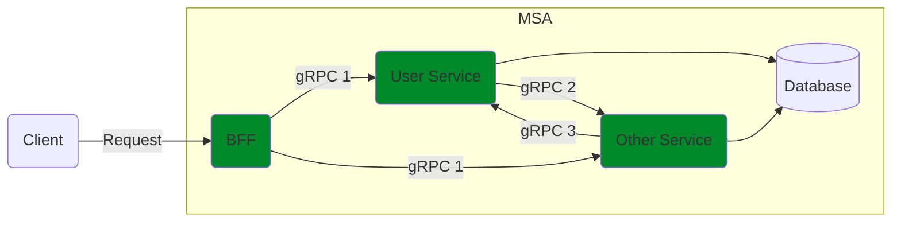

## Flowchart Microservices

## Questions
- How to manage interfaces between services?
- How to document API?
- How to support multiple languages?

## BFF
[https://bff-patterns.com/](https://bff-patterns.com/)

## Protobuf
[https://protobuf.dev/](https://protobuf.dev/)

## Configuration

### Setup Protobuf
- Define proto files
- Setup generate NestJS gRPC

### Implement User Service
- Setup Microservice gRPC Server

### Implement BFF
- Implement gRPC client

## Repositories
[BFF](https://github.com/hoangtrucit/factory-demo-nestjs) checkout branch `grpc`

[User Service](https://github.com/hoangtrucit/factory-user-service)

[Protobuf](https://github.com/hoangtrucit/factory-share)