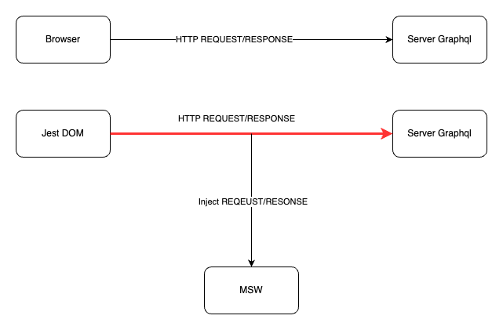

## TechStack

- NextJS [https://nextjs.org/](https://nextjs.org/)
- Graphql/Apollo Client [https://www.apollographql.com/docs/react/](https://www.apollographql.com/docs/react/)
- Tailwindcss [https://tailwindcss.com/](https://tailwindcss.com/)
- Zustand (State Management) [https://github.com/pmndrs/zustand](https://github.com/pmndrs/zustand)
- Jest [https://jestjs.io/](https://jestjs.io/)
- React Testing Library [https://testing-library.com/docs/react-testing-library/intro/](https://testing-library.com/docs/react-testing-library/intro/)
- MSW (Testing, Mocking) [https://v1.mswjs.io/](https://v1.mswjs.io/)
- [Codegen](./CODEGEN.md)

## Mock Test

## Atomic Design

[Atomic Design](https://atomicdesign.bradfrost.com/chapter-2/)
